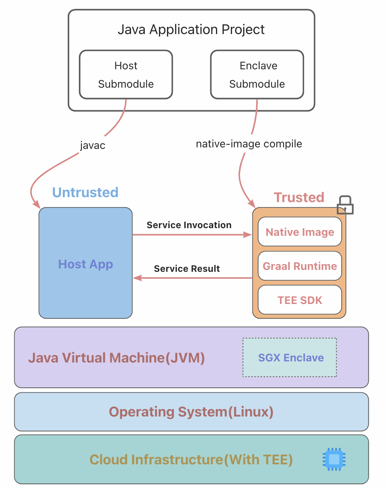
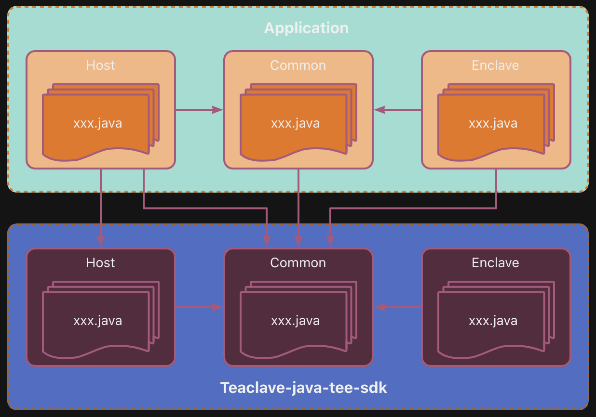
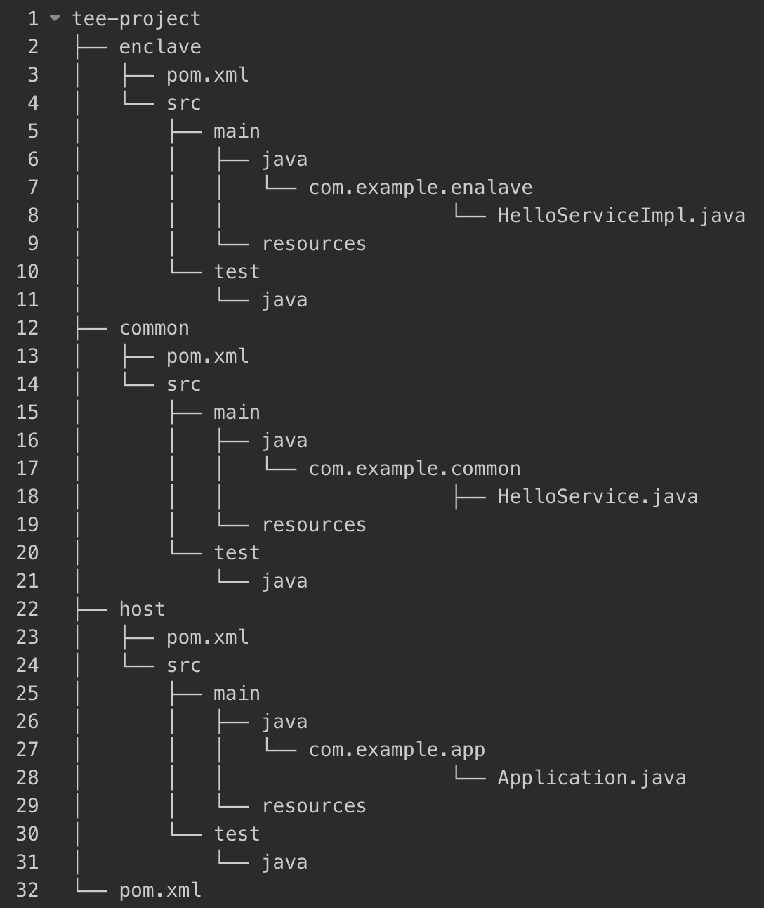

## What's JavaEnclave?

JavaEnclave is a Java confidential computing programming model. It follows the host-and-enclave partition programming model defined by Intel-SGX SDK. JavaEnclave provides an elegant way to divide a java project into host and enclave modules, the enclave module is a provider of a user-defined service interface, it's similar to the SPI development model. JavaEnclave could help you to develop and build a Java confidential computing project with high efficiency.

## Why do we need JavaEnclave?

Occlum and Gramine libOS solutions run the entire Java application inside the enclave. Although it's much easier for end users, it suffers from a large TCB(Trusted Computing Base) that may compromise the security to some degree. On the other hand, Intel-SGX and OpenEnclave SDKs are more secure by only running the sensitive code inside the enclave, but they are limited to C/C++ ecosystem, and the development experience for programmers is unfriendly. For Example, it requests the programmer to provide an unknown .edl file, which defines the interface between host and enclave. While JavaEnclave provides a pure java development interface for programmers to develop a Java confidential computing application with high security, programmers do not need to provide any configured file, it also provides a concise API to create enclaves and invoke enclave service. In one word, JavaEnclave makes SPI Provider a confidential computing service.

## JavaEnclave architecture

JavaEnclave provides seven components:

- JavaEnclave Host .jar, provides API to create and destroy enclave instances, enclave service loading and unloading, remote attestation quote generation, and verification.

- JavaEnclave Enclave .jar, makes java native image runs in sgx enclave environment, and provides a stub between host and enclave for their interaction.

- JavaEnclave Common .jar, provides an annotation for application, which helps to register user-defined interface parameters' type information for native image reflection. Also, it defines the interface between host and enclave for underlying interaction, and it's transparent for the application.

- JavaEnclave SDK, provides all kinds of underlying JNI .so and building toolchains.

- JavaEnclave Archetype project, helps the user to create a Java confidential computing project Structure.

- Native BouncyCastle third-party package, helps the user to apply BouncyCastle in the enclave native environment without reflection issues.

- JavaEnclave Docker, provides a standard build and execution environment for Java confidential computing applications.



## Confidential computing Java project structure based on JavaEnclave

A Java confidential computing application project based on JavaEnclave is a maven project which consists of three submodules, they are host submodule, enclave submodule, and common submodule. The common submodule contains the service interface definition, the enclave submodule implements the interface defined in the common submodule, host submodule contains the management of the enclave instance and service instance. We can view the enclave submodule as an SPI provider, JavaEnclave will help to run the provider in an enclave, the provider could be compiled to a native image or a jar file.





## Getting started

### Environment preparation

#### 1. Is SGX2 supported?

`apt install cpuid && cpuid -1 -l 0x12`


if SGX2 is not supported, only MOCK_IN_JVM and MOCK_IN_SVM enclave modes in JavaEnclave could be run normally.

#### 2. Is the SGX2 driver installed?

`cd /dev` and check whether `sgx_enclave sgx_provision` soft link files exist.

if it is not, you need to install the sgx driver according to reference: https://github.com/intel/linux-sgx-driver.

#### 3. enable_rdfsbase kernel module

if Linux kernel before 5.9, please install the enable_rdfsbase kernel module according to reference: https://github.com/occlum/enable_rdfsbase. enable_rdfsbase kernel module is needed if you create an enclave instance with EMBEDDED_LIB_OS mode defined in JavaEnclave.

#### 4. Enter JavaEnclave docker

`docker run -it --privileged --network host -v /dev/sgx_enclave:/dev/sgx/enclave -v /dev/sgx_provision:/dev/sgx/provision javaenclave:v0.1.0-ubuntu18.04`

JavaEnclave Docker provides a compilation and deployment environment for a java confidential computing application based on JavaEnclave.

### HelloWorld sample instruction

#### 1. Create a HelloWorld project structure

JavaEnclave provides a java confidential computing archetype project to help us create a basic project structure.

`mvn archetype:generate -DgroupId=com.sample.helloworld -DartifactId=helloworld -DarchetypeGroupId=com.alibaba.confidentialcomputing -DarchetypeArtifactId=javaenclave-archetype -DarchetypeVersion=0.1.0 -DinteractiveMode=false`

archetype creates a maven project with three submodules, a host submodule enclave submodule, and a common submodule.

#### 2. Define enclave service interface in the common submodule

`cd helloworld/common/src/main/java/com/sample/helloworld/` and create a common package in this submodule `mkdir common`.

then create a Service.java file to define an enclave service interface.

```java
package com.sample.helloworld.common;

import com.alibaba.confidentialcomputing.common.annotations.EnclaveService;

@EnclaveService
public interface Service {
    String sayHelloWorld();
}
```

Note that we have to annotate this service interface with `@EnclaveService` which JavaEnclave provides.

#### 3. Create enclave service interface provider in enclave submodule

`cd helloworld/enclave/src/main/java/com/sample/helloworld` and create an enclave package in this submodule `mkdir enclave`.

then create ServiceImpl.java to implement the service interface defined in the common package.

```java
package com.sample.helloworld.enclave;

import com.sample.helloworld.common.Service;
import com.google.auto.service.AutoService;

@AutoService(Service.class)
public class ServiceImpl implements Service {
    @Override
    public String sayHelloWorld() {
        return "Hello World";
    }
}
```

Note that we have to annotate this class with the annotation `@AutoService(Interface. class)`.

#### 4. Develop host submodule to create and invoke enclave service

`cd helloworld/host/src/main/java/com/sample/helloworld` and create an host package in this submodule `mkdir host`.

then create Main.java to show how to create and invoke an enclave service.

```java
package com.sample.helloworld.host;

import com.alibaba.confidentialcomputing.host.Enclave;
import com.alibaba.confidentialcomputing.host.EnclaveFactory;
import com.alibaba.confidentialcomputing.host.EnclaveType;

import com.sample.helloworld.common.Service;

import java.util.Iterator;

public class Main {
    public static void main(String[] args) throws Exception {
        EnclaveType[] enclaveTypes = {
                EnclaveType.MOCK_IN_JVM,
                EnclaveType.MOCK_IN_SVM,
                EnclaveType.TEE_SDK,
                EnclaveType.EMBEDDED_LIB_OS};

        for (EnclaveType enclaveType : enclaveTypes) {
            Enclave enclave = EnclaveFactory.create(enclaveType);
            Iterator<Service> services = enclave.load(Service.class);
            System.out.println(services.next().sayHelloWorld());
            enclave.destroy();
        }
    }
}
```

#### 5. Build and run

cd back to HelloWorld project top dir and build it: `mvn -Pnative clean package`.

Note that parameter `-Pnative` should not be ignored.

then we could run this sample: `OCCLUM_RELEASE_ENCLAVE=true java -cp host/target/host-1.0-SNAPSHOT-jar-with-dependencies.jar:enclave/target/enclave-1.0-SNAPSHOT-jar-with-dependencies.jar com.sample.helloworld.host.Main`

## Four enclave types in JavaEnclave

### MOCK_IN_JVM mode

`MOCK_IN_JVM` mode in JavaEnclave is a simulated mode, it doesn't need SGX hardware support. The host module and enclave module run in the same JVM environment.
In essence, it's an SPI mechanism between host and enclave parts.

### MOCK_IN_SVM mode

`MOCK_IN_SVM` mode in JavaEnclave is also a simulated mode, it doesn't need SGX hardware support. Compare with `MOCK_IN_JVM` mode, the enclave submodule
will be compiled into a native image, and the host submodule run in a JVM environment. host part will load, create and invoke service defined in enclave by JNI native call.

### TEE_SDK mode

`TEE_SDK` mode is a hardware mode, it must run on the platform with SGX2 hardware support. Compare with `MOCK_IN_SVM` mode, the enclave submodule also will be compiled into a native image, but it will be loaded and run in sgx enclave environment. The host part will run in a JVM environment, and both the host and enclave module will run in one process.

### EMBEDDED_LIB_OS mode

`EMBEDDED_LIB_OS` mode is also a hardware mode, it must run on the platform with SGX2 hardware support. Compare with `TEE_SDK` mode, the enclave submodule will be compiled into a jar file, and it will be loaded and run in an enclave with libOS Occlum, an inner alpine JVM runs based on this libOS. The host part runs in another JVM based on a normal environment. The two JVM instances co-existence and run in one process.

## JavaEnclave configuration

please refer to the link: [Configuration.md](./sdk/host/docs/Configuration.md)